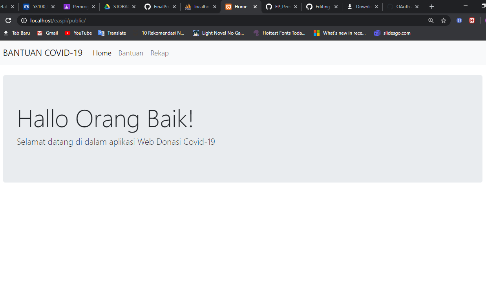
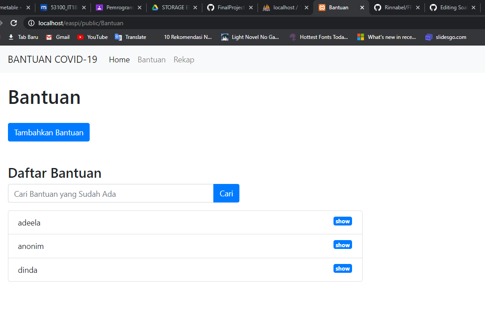
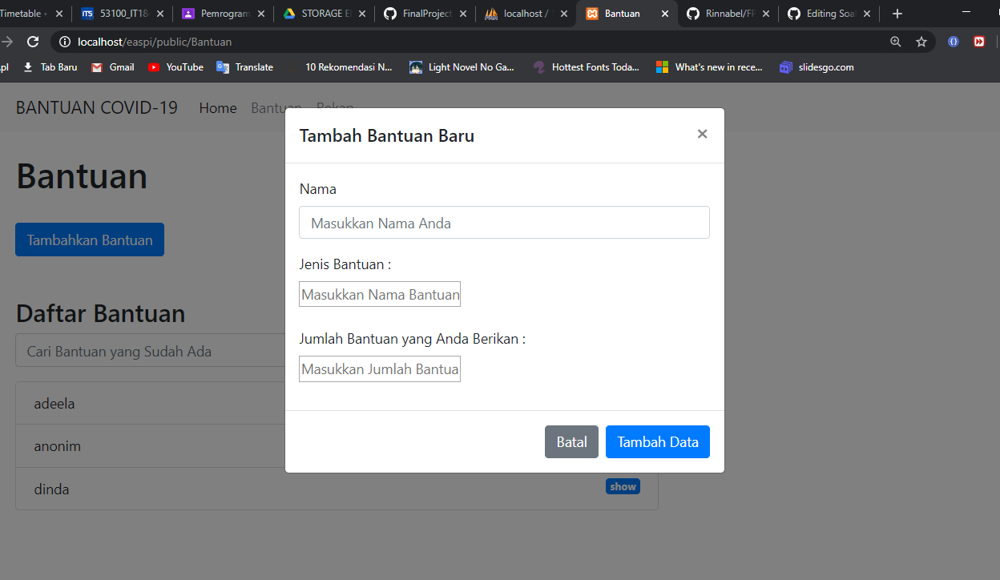
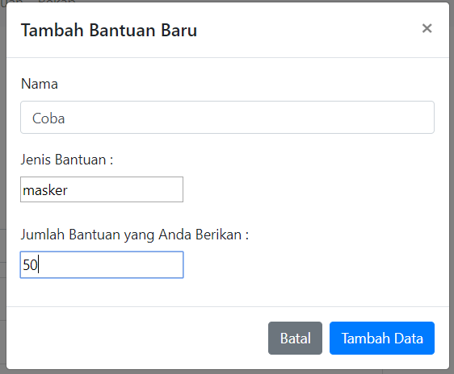
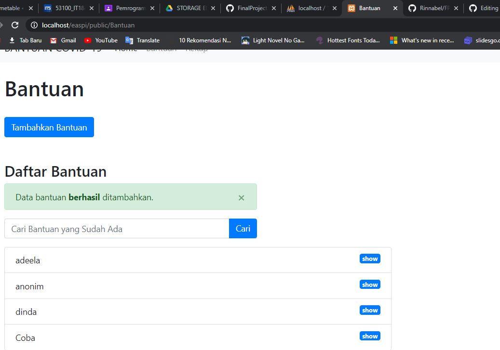

# FP_PemrogramanIntegratif_05311840000001

# ADEELA NURUL FADHILA
# 05311840000001

## Penjelasan Singkat Aplikasi

Aplikasi berikut ini merupakan aplikasi donasi sederhana yang berbasis web. Di dalam aplikasi ini, user dapat memberikan donasi/bantuan dengan cara menginput data-data berupa nama pemberi sumbangan, jenis barang apa yang akan disumbangkan (beras, mie, gula, dll), dan juga jumlah barangnya. selain itu, user juga dapat melihat hasil rekapan dari sumbangan yang sudah diperoleh, seperti berapa total beras yang sudah disumbangkan, dan juga barang-barang apa yang disumbangkan

## Penjelasan Fitur Aplikasi

### 1. Home

Gambar di atas merupakan Home atau beranda dari aplikasi ini. Di sini terdapat tiga navbar, yaitu "Home", "Bantuan", dan "Rekap".

### 2. Bantuan

Ketika navbar "Bantuan" yang ada di Beranda aplikasi diklik, maka akan mengahkan ke page Bantuan. Di page ini terdapat tombol "Tambahkan Bantuan" yang dapat digunakan untuk menambahkan data barang bantuan. Kemudian juga terdapat search bar, namun tidak saya beri fiturnya dan juga terdapat daftar nama pemberi bantuan.

### 3. Menambahkan Bantuan

Jika tombol "Tambahkan Bantuan" yang ada di page Bantuan diklik, maka akan muncul pop-up window yang berisi form untuk mengisi data-data yang diperlukan untuk donasi. Ketika datanya sudah selesai diisi, user bisa mengeklik tombol "Tambah Data" yang ada di pojok kanan bawah pop-up window.

Berikut ini adalah tampilan bila berhasil menginputkan data.

